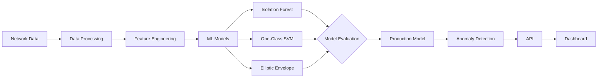

<h1>
  Hi
  
  , I'm Mohamed Aziz TURKI
</h1>

<h3>Software Engineering Student</h3>

📍 Tunis, Tunisia

&nbsp;

&nbsp;

 
 

---

## About Me

I hold a **Bachelor's degree in Business Computing (ESSECT, University of Tunis, 2026)** and I am now pursuing a **Software Engineering degree at ESPRIT (2026–2029)**.

I design and build software systems across backend, frontend, data/ML and automation, with a focus on turning real-world problems into **maintainable, automated and production-oriented solutions**.

**Areas of work:** Backend engineering · Frontend development · Data & Machine Learning · Cloud & infrastructure · Automation

---

## Featured Project

### [OptiX — FTTH Network Anomaly Detection](https://github.com/mazizturki/optix)

**OptiX** is an intelligent platform that detects and analyzes anomalies in **FTTH networks**, combining machine learning with network-specific business rules.

**ML approach.** The workflow follows the **CRISP-ML(Q)** methodology and compares three unsupervised models: **Isolation Forest**, **One-Class SVM** and **Elliptic Envelope**. **Isolation Forest** is used in production, selected according to the project's evaluation criteria and inference requirements.

**Stack:** `FastAPI` · `React` · `TypeScript` · `PostgreSQL` · `Redis` · `Keycloak` · `MLflow` · `n8n` · `Docker`

<b>View architecture</b>

---

## Technical Skills

**Backend**  

**Frontend & Mobile**  

**Databases**  

**Data, AI & ML**  

**Infrastructure & Tools**  

---

## Current Focus

- Software architecture and API design
- Scalable backend systems
- Machine learning pipelines, MLOps and model lifecycle management
- Containerization, infrastructure and production deployment

---

## GitHub Activity

---

## Let's Connect

I'm open to **technical collaborations, freelance projects and opportunities** to build practical software solutions.

Building software · Learning continuously · Solving real problems

